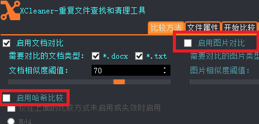
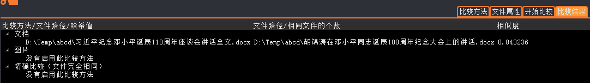
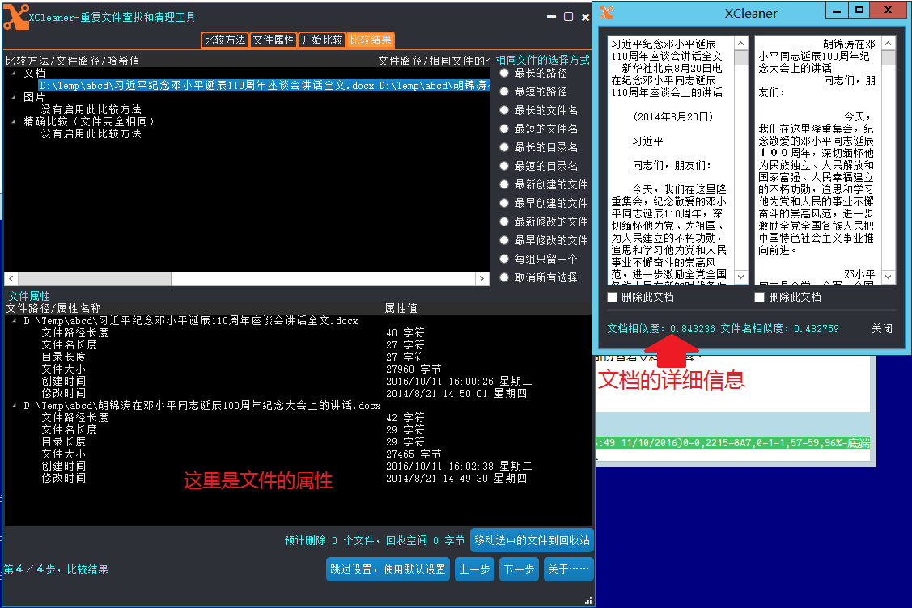

%XCleaner 使用手册
% 昂昂解决方案工作室
% 2016年10月11日

XCleaner 重复文件查找和清理工具
================================

XCleaner 介绍
--------------

XCleaner
是一个重复文件查找和清理工具。XCleaner使用三种方法来确定文件是相似的还是相同的：

#. 对于 word 文档(.docx)和.txt文档，使用内容分析的方式两两对比，得到其相似度；
#. 对于图片文件.bmp、.jpeg、.jpg和.png，使用图片分析的方式两两对比，得到其相似度；
#. 对于所有类型的文件，使用计算哈希值的方式确定文件是否相同。

XCleaner
查找到相似或相同的文件后，会显示在一个树状列表里，然后用户可以在列表里选择需要清理的文件。XCleaner不直接删除文件，它会把文件都移动到
Windows
系统的回收站里。只有当用户清空回收站后，文件才会被真正删除，才能真正回收磁盘空间。

XCleaner 使用示例
------------------

在做下面的操作前，要启动 XCleaner。

###比较 .docx 文件

1. 
取消下图中红色框中的两个选择框。因为我们要对比的是.docx文档，所以可以不启用图片对比和哈希比较；

2. 单击`开始比较`标签页；

3. 单击`添加`按钮，选择要比较的.docx档所在的目录；

4.
然后弹出一个对话框。在弹出的对话框里选择参与比较的目录后，会看到在XCleaner的`参与比较的目录`列表里出现了刚才选中的目录：

5. 参考第3步中的按钮，点击`开始比较`就可以开始比较了。XCleaner
会扫描指定目录中的所有文件，找出其中的.docx文件和.txt文件（注意：第1步中我们选中了.docx和.txt两种文件），然后两两比较，得到其相似度。

6. 比较结果示例：

7. 单击列表中相似的项目，可以查看文件的详细信息：

8.
在上面的例子中，如果只需要保留其中一个文档，选中另一个文档下面的`删除此文档`选择框就可以了。选择之后，点`关闭`按钮，回到主窗口，点击`移动选中的文件到回收站`按钮，选中的文档就被移动到回收站了。

